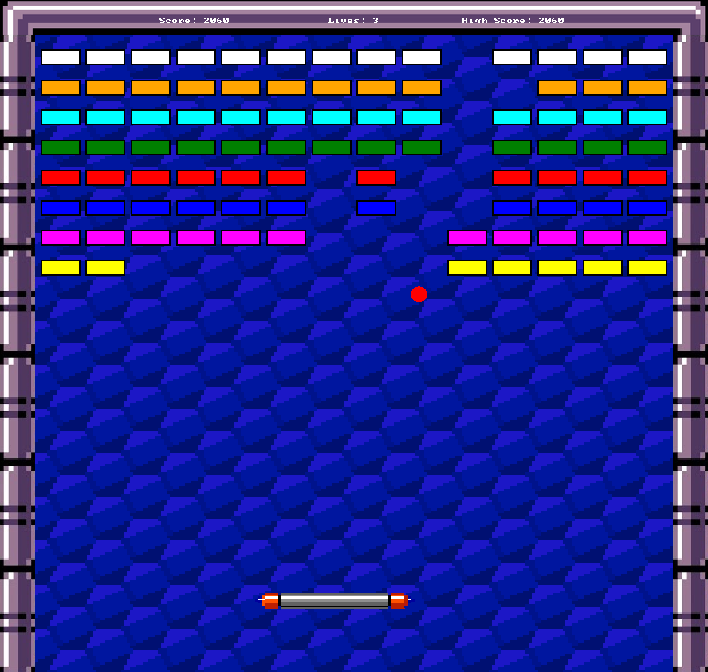

# Arkanoid - 2024

## Description

Arkanoid is a brick-breaking game developed as part of the Programming Language 2 (`INFO-F202`) course. This project uses the Allegro library for graphics and event handling.

For more details, please refer to [`./pdf/project-2024.pdf`](./pdf/project-2024.pdf).

<p align="center">
  
  <br/>
  <strong>Classic Game of the Arkanoïd Project</strong>
</p>

## Features

- Paddle movement with keyboard and mouse
- Different types of bricks with varying hit points
- Various power-ups (duplication, laser, enlargement, etc.)
- Level and score management
- Graphical effects

## Prerequisites

- C++20 or higher
- Allegro 5 library

## Installation

1. Clone the repository:

   ```bash
   git clone https://github.com/Ant0in/Arkanoid-Projet-LDP2.git
   ```

2. Navigate to the project directory:

   ```bash
   cd Arkanoid-Projet-LDP2/
   ```

3. Install Allegro dependencies:

   ```bash
   sudo apt-get install liballegro5-dev
   ```

## Compilation

To compile the project, use the provided `Makefile`:

```bash
make
```

## Running the Project

To run the project, use the following command:

```bash
./main
```

## Usage

- Use the `A` or `Q` keys to move the paddle left.
- Use the `D` or `P` keys to move the paddle right.
- Use the `Z` or `Space` key to launch the ball or fire a laser.
- Use the left and right arrow keys to change levels.
- Use the `R` key to reset the score.
- Use the `Enter` key to restart the game after a Game Over.

## Project Structure

```
.
├── assets/
│   ├── background/
│   ├── bonus/
│   └── bricks/
├── include/
│   ├── ball.hpp
│   ├── bonus.hpp
│   ├── brick.hpp
│   ├── collision_helper.hpp
│   ├── common.hpp
│   ├── controller.hpp
│   ├── engine.hpp
│   ├── game_box.hpp
│   ├── gui.hpp
│   ├── laser.hpp
│   ├── level_manager.hpp
│   ├── level_reader.hpp
│   ├── player.hpp
│   ├── racket.hpp
│   ├── score.hpp
│   ├── solid_shapes.hpp
│   └── texture_manager.hpp
├── src/
│   ├── common.cpp
│   ├── game/
│   │   ├── ball.cpp
│   │   ├── bonus.cpp
│   │   ├── brick.cpp
│   │   ├── game_box.cpp
│   │   ├── laser.cpp
│   │   ├── level_manager.cpp
│   │   ├── level_reader.cpp
│   │   └── racket.cpp
│   ├── gui/
│   │   ├── gui.cpp
│   │   └── texture_manager.cpp
│   ├── physics/
│   │   ├── collision_helper.cpp
│   │   └── engine.cpp
│   ├── player/
│   │   ├── controller.cpp
│   │   ├── player.cpp
│   │   └── score.cpp
│   └── main.cpp
├── maps/
├── pdf/
├── .clang-format
├── .gitignore
├── LICENSE.txt
├── Makefile
├── highscore.txt
└── readme.md
```

## License

This project is licensed under the MIT License. You are free to use, modify, and distribute this software.

## Acknowledgements

This project was developed for the Programming Language 2 (`INFO-F202`) course. Special thanks to `John Iacono (ULB)` for his guidance and support.
